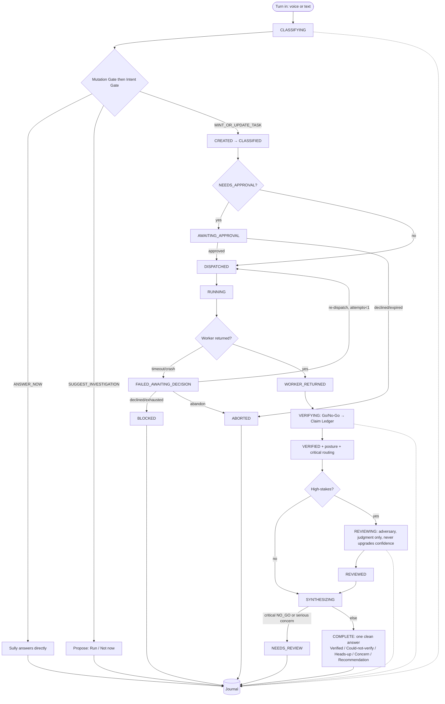

# Sully Task-First Workflow — v1 State-Machine Spec (behavior lock)

> **Status:** behavior spec for review (v1.1 — hardened after an adversarial pass). Locks BEHAVIOR before schema/implementation. Approved flow: GPT + PXY + operator + CC aligned (2026-06-04). Source design: `data/peer_reviews/2026-06-04_sully-phase4-verification_design.md` + the operator's full-flow sanity check.
>
> **Scope of v1:** strictly **linear**, **no auto-repair loops**. Builder → deterministic Go/No-Go → (gated) adversary → one clean Sully answer → forensic journal. Self-repair, multi-round review, and the full workspace/artifact layer are explicitly OUT of v1 (§12).
>
> **Adversarial review (2026-06-04) fixed before lock:** undocumented re-dispatch loop (now a counted, operator-gated single backward edge); Intent/Mutation gate composition (precedence now explicit); "critical claim" defined (drives NEEDS_REVIEW vs warn); ATTACH-mid-pipeline (now pre-dispatch-only); VERIFYING/REVIEWING totality; approval/ proposal expiry; all-UNKNOWN framing; per-terminal-state operator wording.

---

## 0. Core invariants (must hold in every path)

Non-negotiable. Every state and transition below obeys them.

- **I1 — Facts come only from deterministic GO.** A claim may be stated as fact **only** if a deterministic check returned GO. AI judgment (the adversary) can **never** produce a fact and **never** upgrade confidence — only add caveats, flag risks, lower confidence, or recommend review.
- **I2 — One pipeline for voice and text.** `text` and `voice` (talkback or standalone) are the same Sully underneath: same gates, task lifecycle, memory, dispatch, verification, journal, final-answer behavior. Input mode is recorded, never branched on for capability.
- **I3 — Conversational by default.** A task is minted only on explicit work intent, an `@cc`/`@agy` command, or a confirmed suggestion (Contract 1).
- **I4 — Classify before you answer.** Every turn is classified **before** Sully produces a full answer. For a worker-dependent answer she emits only a short status ("On it.") and the full answer comes after verification. This is also the fix for the chat-contradiction bug.
- **I5 — Linear, no auto-loops (v1).** The pipeline has exactly **one** backward edge: an operator-approved re-dispatch after a failure, capped at 1 attempt (§10). Nothing loops automatically. Serious concerns/failures resolve to a terminal `NEEDS_REVIEW` / `BLOCKED` awaiting the operator.
- **I6 — Journal every stage.** Each transition + artifact (intent, route, worker output, claims, matrix, concerns, summary, outcome) is journaled — not just the final answer.
- **I7 — Never block or lose a real result.** Verification/review that times out or errors degrades to UNKNOWN / "review unavailable" (a hedge), never to silence or a dropped result. `VERIFYING` and `REVIEWING` are **total** — they cannot fail the task.
- **I8 — `allowed_in_final == (verification_status == GO)`.** Only GO claims may be asserted as fact. NO_GO and UNKNOWN are surfaced through their own channels (warning / hedge), never as bare facts.

---

## 1. Contract 1 — Intent Gate (REQUIRED)

**Every turn terminates in exactly one of three outcomes.** Never zero, never two.

| Outcome                 | Meaning                                                                         | What Sully does                                               | Mints a task?                 |
| ----------------------- | ------------------------------------------------------------------------------- | ------------------------------------------------------------- | ----------------------------- |
| `ANSWER_NOW`            | Pure conversation/reasoning; answerable from context, no external state/worker. | Answers directly.                                             | No                            |
| `SUGGEST_INVESTIGATION` | Work _might_ help, but no explicit work intent yet.                             | Proposes (Run / Not now), then waits. Does **not** dispatch.  | No (a _proposal_, not a task) |
| `MINT_OR_UPDATE_TASK`   | Explicit work intent, an `@cc`/`@agy` command, or a confirmed prior suggestion. | Mints/updates a task (Contract 2); emits a short status only. | Yes                           |

**Inputs** (reuses shipped `decide()` — Talk→ANSWER_NOW, Ask→SUGGEST_INVESTIGATION, Dispatch→MINT_OR_UPDATE_TASK):

- explicit `@cc`/`@agy`/`@gemini` → `MINT_OR_UPDATE_TASK`.
- work-intent verb (build, implement, audit, verify, check, create, generate, run, inspect, fix, diagnose, move, write) + a real object → `MINT_OR_UPDATE_TASK`.
- prior open proposal + this turn is an affirmation / Run tap → `MINT_OR_UPDATE_TASK` (consume the proposal).
- prior **routing ask** (Contract 2 ambiguity) + this turn answers it ("the running one" / "a new one") → `MINT_OR_UPDATE_TASK` on the chosen target (consume the routing proposal).
- qualifying-but-unconfirmed work intent → `SUGGEST_INVESTIGATION`.
- brainstorming / opinions / planning / casual / pasted / injection-guarded text → `ANSWER_NOW`.
- **Totality guard:** if `decide()` ever returns anything outside {Talk, Ask, Dispatch}, default to `ANSWER_NOW` (safest, non-dispatching) and journal an anomaly.

**Proposal lifetime + uniqueness:** a proposal (including a Contract-2 routing ask) lives only until the operator's immediate next turn (consume-on-affirm, expire-otherwise). **At most one open proposal per thread** — a new proposal supersedes and expires any prior open one (journaled); an affirmation always consumes the single most-recent open proposal.

---

## 2. Contract 2 — Task Mutation Rule (REQUIRED)

**When a task is active on the thread, the Mutation Gate runs FIRST** (inside `CLASSIFYING`), then composes with the Intent Gate:

| Outcome                  | Meaning                                                                  | Resolves the turn to                                                         |
| ------------------------ | ------------------------------------------------------------------------ | ---------------------------------------------------------------------------- |
| `ATTACH_TO_CURRENT_TASK` | Input changes/extends the running task's scope.                          | `MINT_OR_UPDATE_TASK` (UPDATE path), subject to the timing rule below.       |
| `CREATE_SIBLING_TASK`    | Clearly separate work.                                                   | `MINT_OR_UPDATE_TASK` (MINT a new `task_id`). Runs concurrently.             |
| `CONVERSATIONAL_ONLY`    | Neither modifies the running task **nor expresses any new work intent**. | Falls through to the Intent Gate (→ `ANSWER_NOW` / `SUGGEST_INVESTIGATION`). |

**Precedence + gap-closure (so the turn always lands in one Contract-1 outcome):**

- The Mutation Gate's `ATTACH`/`CREATE_SIBLING` both resolve to `MINT_OR_UPDATE_TASK`. `CONVERSATIONAL_ONLY` hands to the Intent Gate.
- **If a `CONVERSATIONAL_ONLY` fall-through then yields `MINT_OR_UPDATE_TASK`** (the turn actually carried new work intent), it is treated as `CREATE_SIBLING_TASK` (a new task), and the reclassification is journaled. (Closes the "Mutation Gate called it chat but it was new work" gap.)
- **Ambiguity (ATTACH vs SIBLING unclear):** Sully asks — _"Add that to the task that's running, or start a separate one?"_ This is a `SUGGEST_INVESTIGATION` **routing proposal**; the operator's next-turn answer is consumed exactly like a proposal affirmation (§1).

**ATTACH timing rule (preserves I5 + I7):** ATTACH is applied to the running task **only while it is pre-dispatch** (`CREATED` / `CLASSIFIED` / `AWAITING_APPROVAL`). **Once `DISPATCHED`, an ATTACH is never injected into the in-flight pipeline** (no backward edge). Instead Sully either (a) queues it to apply as a follow-up turn after the task reaches `COMPLETE`, or (b) offers `CREATE_SIBLING_TASK`. The operator's change is **never silently dropped**. The Mutation Gate therefore reads the task's current **state**, not merely "a task is active."

**Concurrency note:** multiple tasks MAY run at once (each independent + fire-and-forget). "Linear" (I5) constrains each task's **own** pipeline, not how many exist. Dispatch brakes (daily cap, fingerprint, token bucket) still bound total volume.

---

## 3. Contract 3 — Claim Ledger (REQUIRED)

Bridge between Go/No-Go and the final answer. **Built during `VERIFYING`. One row per discrete claim.**

```
ClaimLedgerEntry {
  claim:               string          // the assertion, e.g. "PR #5 merged"
  source:              string          // worker id (cc/agy) or 'system'
  verification_status: 'GO' | 'NO_GO' | 'UNKNOWN'
  evidence_pointer:    string | null   // telemetry checked: SHA, PR#, path, URL, db query — null if UNKNOWN
  critical:            boolean         // set DETERMINISTICALLY at ledger-build time, never by AI (see below)
  allowed_in_final:    boolean         // INVARIANT I8: true iff verification_status == 'GO'
}
```

**`critical` (deterministic — drives the terminal-state routing, F10):** a claim is **critical** iff it asserts the task's _primary success condition_ — the mutation of real state the operator relied on the task to achieve (e.g. "PR merged", "file written", "service restarted", "build shipped"). Secondary/descriptive claims (counts, durations, side-observations) are **non-critical**. A **worker-completion or task-state NO_GO is critical by definition** (the work didn't actually finish).

**Resolution rules (locked):**

- `GO` → `allowed_in_final = true`. Stated as fact in "Verified."
- `NO_GO` → `allowed_in_final = false`. Triggers a **warning**; forces `warn` posture.
- `UNKNOWN` → `allowed_in_final = false`. May be **relayed as an explicit hedge**, never a bare fact.

**Terminal-state routing from the ledger (removes the NEEDS_REVIEW-vs-warn ambiguity):**

- **any `critical` NO_GO** → task ends `NEEDS_REVIEW` (the task did not achieve its purpose; parked with caveats, no auto-repair).
- **only non-critical NO_GO(s)**, critical claim GO/UNKNOWN → task ends `COMPLETE` with `warn` posture (the thing happened; a secondary claim contradicted — flag it).
- **a serious adversary concern** (judgment) → `NEEDS_REVIEW` (§5/§8).

**Posture** (drives wording, computed in the same deterministic pass): any `NO_GO` → `warn`; else any active `UNKNOWN` → `hedge`; else `confirmed`. `critical` is set by the deterministic verifier, never the adversary (I1).

**Adversary findings are NOT ledger entries.** Separate `AdversaryFinding[]` (`source='adversary'`, judgment, never `allowed_in_final` as fact), surfaced only under "Reviewer concern."

---

## 4. Turn state machine (every inbound message)

```
RECEIVED ──▶ CLASSIFYING ──▶ { ANSWER_NOW | SUGGEST_INVESTIGATION | MINT_OR_UPDATE_TASK }
```

- `RECEIVED` — message in (voice transcribed or typed; mode recorded). → `CLASSIFYING`.
- `CLASSIFYING` — if a task is active, run the **Mutation Gate** (Contract 2) first; then the **Intent Gate** (Contract 1). Produces exactly one outcome. **No full answer streams before this completes (I4).**
- `ANSWER_NOW` → reply directly → `TURN_JOURNALED` → end.
- `SUGGEST_INVESTIGATION` → post a proposal (Run / Not now) → `TURN_JOURNALED` → end (next turn resolves/expires it; proposal expiry is a **turn-level** event, never a task state).
- `MINT_OR_UPDATE_TASK` → enter the Task state machine (§5); emit a short status only ("On it.") → `TURN_JOURNALED`.

---

## 5. Task state machine (per task — linear; one operator-gated backward edge only)

```
CREATED → CLASSIFIED → [AWAITING_APPROVAL] → DISPATCHED → RUNNING → WORKER_RETURNED
        → VERIFYING → VERIFIED → [REVIEWING → REVIEWED] → SYNTHESIZING → COMPLETE
```

> **The §5 table is normative.** The §13 mermaid is a simplified view.

| State               | What happens                                                                                                                                                                                                                                                                                                          | Exits to                                                |
| ------------------- | --------------------------------------------------------------------------------------------------------------------------------------------------------------------------------------------------------------------------------------------------------------------------------------------------------------------- | ------------------------------------------------------- |
| `CREATED`           | New `task_id` minted; task object initialized (§5.1). (An ATTACH/UPDATE to an existing pre-dispatch task re-enters at `CLASSIFIED`, **not** `CREATED`.)                                                                                                                                                               | `CLASSIFIED`                                            |
| `CLASSIFIED`        | Sub-classification + route: `NEEDS_WORKER` / `NEEDS_APPROVAL` (v1) · `NEEDS_CONTEXT_CHECK` / `WORKSPACE_UPDATE` (stubbed — see §12). Worker(s) + reason recorded.                                                                                                                                                     | `AWAITING_APPROVAL` (if risky) · else `DISPATCHED`      |
| `AWAITING_APPROVAL` | Risky/destructive/expensive/high-impact work pauses for the operator. **No auto-approve (fail-closed).** After an idle window it **expires** → `ABORTED (approval_expired)`.                                                                                                                                          | `DISPATCHED` (approved) · `ABORTED` (declined/expired)  |
| `DISPATCHED`        | Handed to the worker. **Code/file work runs in an isolated worktree**, never main/stable, unless explicitly approved.                                                                                                                                                                                                 | `RUNNING`                                               |
| `RUNNING`           | Worker executing. Conversation stays open (I2/§6). Soft-stall messaging (§7). Live Task card.                                                                                                                                                                                                                         | `WORKER_RETURNED` · `FAILED` (timeout/crash)            |
| `WORKER_RETURNED`   | Worker callback received with output + **evidence envelope** (telemetry pointers).                                                                                                                                                                                                                                    | `VERIFYING`                                             |
| `VERIFYING`         | **Go/No-Go poll** runs deterministic checks; builds the **Claim Ledger** (Contract 3). No AI in the verdict. **Total: every check resolves to GO/NO_GO/UNKNOWN; a check that errors/times out resolves to UNKNOWN (I7). Cannot fail.**                                                                                | `VERIFIED` (only exit)                                  |
| `VERIFIED`          | Matrix complete; posture + critical-routing computed.                                                                                                                                                                                                                                                                 | `REVIEWING` (if stakes-gated, §8) · else `SYNTHESIZING` |
| `REVIEWING`         | **Adversary review** (AI judgment only): request + output + diff + Go/No-Go matrix + unknowns → concerns. **Cannot upgrade confidence.** **Total: if the adversary errors/times out, record `adversary_findings=[{source:'adversary',status:'unavailable'}]` and proceed; never blocks, never changes posture (I7).** | `REVIEWED` (only exit)                                  |
| `REVIEWED`          | Concerns attached.                                                                                                                                                                                                                                                                                                    | `SYNTHESIZING`                                          |
| `SYNTHESIZING`      | Sully composes ONE final answer from the ledger + concerns (§9). Terminal chosen by Contract-3 routing.                                                                                                                                                                                                               | `COMPLETE` · `NEEDS_REVIEW` · `BLOCKED`                 |
| `COMPLETE`          | Final answer posted (posture confirmed/hedge/warn). **Terminal.**                                                                                                                                                                                                                                                     | —                                                       |

**Terminal / branch states:**

- `ABORTED` — approval declined or expired. (Proposal expiry is turn-level, not here.) Terminal.
- `FAILED` — worker timed out/crashed. → capture partial state → `FAILED_AWAITING_DECISION`.
- `FAILED_AWAITING_DECISION` — holding state: Sully offers **Review failure** (safe inspection) / re-dispatch / abandon. **Re-dispatch is the ONLY backward edge in v1**, operator-gated, allowed only if `recovery_attempts < 1` (then increments it). Exits: `DISPATCHED` (re-dispatch approved, counter<1) · `BLOCKED` (declined, or counter exhausted) · `ABORTED` (abandon).
- `NEEDS_REVIEW` — a **critical** `NO_GO` OR a serious adversary concern. Presented with caveats; **no auto-repair (I5).** Terminal.
- `BLOCKED` — failure needing an operator decision. Terminal.

Every transition writes a journal event (I6).

### 5.1 Task object (behavior-level; schema deferred)

`task_id` · `conversation_id` · `message_id` · `input_mode (text|talkback|voice)` · `user_request` · `normalized_intent` · `classification` · `route` · `worker(s)` · `route_reason` · `status` · `recovery_attempts (int, default 0, max 1)` · `created_at` · `updated_at` · `workspace_id?` · `artifact_refs?` · `claim_ledger (entries carry `critical`)` · `adversary_findings` · `posture` · `final_summary` · `outcome` · `lessons`.

---

## 6. Background work (locked)

A task never locks the conversation; new turns route via Contract 2. Long jobs continue even if the operator leaves voice mode or closes the app. **The completion push fires only on a terminal state** (`COMPLETE` / `NEEDS_REVIEW` / `BLOCKED` / `FAILED_AWAITING_DECISION`), **never on `WORKER_RETURNED`** — so the deep-link always lands on Sully's composed final answer, never a raw worker dump or a mid-verify card (I4).

---

## 7. Surface behavior (locked)

- One **morphing Task card**; collapses to a compact done strip on finish (shipped). No per-worker message flood.
- Card states: `Created · Classifying · Awaiting approval · Dispatching · Running · Verifying · Reviewing · Summarizing · Complete · Needs review · Blocked · Failed`.
- Soft-stall copy (worker-agnostic, keeps the machinery hidden): `0–60s "Working…"` · `60–120s "Still working…"` · `120s+ "This is taking longer than expected — still working on it."` No fake "almost done."
- Default rhythm: **ask → acknowledge → visible working state → optional drill-down → one final answer.** Audit detail (ledger, matrix, concerns, worker steps) lives in the journal, shown only on tap.

---

## 8. Stakes gate — when the adversary runs

Between `VERIFIED` and `SYNTHESIZING`, **only when gated high**.

**Run for:** code-changing · file-writing/moving · project-state changes · system-health/runtime claims · verification-sensitive claims · anything touching real machine state · anything where a wrong answer creates cleanup work.
**Skip for:** casual chat · brainstorming · low-risk explanation · simple opinions · read-only answers (unless fact-sensitive).

Rationale: the adversary is an extra AI call (quota); gate by stakes. (Most turns are `ANSWER_NOW` and never reach a task.)

---

## 9. Final Sully answer — composition rule (locked format)

`SYNTHESIZING` composes exactly one message that **separates proof from judgment**, plain English, Sully's voice. Sections appear only when they have content:

- **Verified** — every `GO` claim, stated as fact.
- **Could not verify** — `UNKNOWN` claims, **led by the uncertainty, not the claim.** ✅ "I couldn't confirm whether the tests passed — CC said they did, but I have no evidence either way." ❌ "CC said the tests passed; I couldn't confirm." (Don't headline the unverified claim.)
- **Heads-up** — `NO_GO` claims, as warnings (contradiction surfaced).
- **Reviewer concern** — adversary findings, introduced with an explicit judgment frame so it survives voice (no section headers there): _"This is my read, not something I checked: …"_ Never stated as fact.
- **Recommendation** — one line per terminal state (1:1 with §7 card states):
  - `COMPLETE`/confirmed → "Ready."
  - `COMPLETE`/hedge → "Ready for review — not everything could be confirmed."
  - `COMPLETE`/warn → "Done, but heads-up on the flagged item."
  - `NEEDS_REVIEW` → "This needs your review before I'd call it done."
  - `BLOCKED` → "Blocked — I need a decision from you."
  - `FAILED_AWAITING_DECISION` → "It stopped partway. I haven't touched anything further — want me to look at what happened?"
  - `ABORTED` → "I didn't run this — nothing changed."

**Special cases:**

- **All claims UNKNOWN** (nothing was deterministically checkable): lead with framing — _"The work ran, but none of it was something I could independently verify — here's what came back, treat it as unconfirmed."_ Posture = hedge; recommendation = ready-for-review-not-confirmed. (Don't let an empty "Verified" section read as failure.)
- **"All-GO" is never phrased as "it works"** — only "everything I could check held up." (Existence/health ≠ correctness.)

On the happy path (all-GO, no concerns) the operator sees a clean confident answer with at most a quiet ✓.

---

## 10. Failure & approval policy (locked)

- **No infinite retry on code/file work.** On failure: record it, capture partial state → `FAILED_AWAITING_DECISION`. Offer **"Review failure"** (safe inspection) — not a blind "Retry," because files may already have changed.
- **Bounded recovery:** `recovery_attempts` capped at **1**, operator-gated. After the cap → `BLOCKED` / ask (or, if approved, a read-only diagnostic). This single re-dispatch is the only backward edge (I5) and is never automatic.
- Risky/destructive/expensive work pauses at `AWAITING_APPROVAL` (classification `NEEDS_APPROVAL`); no auto-approve; expires to `ABORTED` if the operator stays silent.
- Safe failure wording: _"CC stopped before reporting completion. Some changes may already exist — I can inspect what happened before retrying."_

---

## 11. Forensic journal (locked — all stages, I6)

Per task: original request · input mode · classification · route + reason · worker output · worker claims · evidence pointers · Go/No-Go matrix (with `critical` flags) · adversary findings · final summary · artifacts · errors/retries/recovery · outcome · whether concerns were _ignored / accepted / fixed / deferred_ · whether memory was updated · lessons. Readable via `replayTurn(task_id)`. Audit trail **and** training corpus (route decisions + outcomes + verdicts, not just transcripts).

---

## 12. v1 — explicitly OUT of scope (designed-for, built later)

- **Self-repair loop** (concern → builder → re-verify). v2.
- **Multi-round / panel adversary.** v1 = single advisory pass.
- **`NEEDS_CONTEXT_CHECK` and `WORKSPACE_UPDATE` routes** — stubbed in v1 (the `CLASSIFIED` route enum reserves them); v1 implements `NEEDS_WORKER` + `NEEDS_APPROVAL`. (A context-check would later flow through `VERIFYING` with `source='system'` claims; workspace-update is part of Phase 5.)
- **Full workspace/artifact layer** (Phase 5) — the write-tool + project folders. The lifecycle reserves `workspace_id`; creating files is a separate phase.
- **The streamed-reply edge on the local path:** I4 mandates classify-before-answer; the implementation must gate the first streamed token on the intent decision (a pipeline reorder). Behavior is locked here; the _how_ is an implementation-plan concern.
- **Memory/QLoRA training exporter** consuming the journal — journal is shaped for it (§11), exporter is later.

---

## 13. Linear v1 flow (mermaid — simplified; §5 table is normative)



---

## 14. Sanity-check answers (failure modes this locks out)

1. Sully answering before verification → **prevented** (I4, short-status-only on task turns).
2. Trigger-happy dispatch → **prevented** (Contract 1, conversational default).
3. Voice a reduced path → **prevented** (I2, one pipeline).
4. Chat/voice split histories → **prevented** (I2, shared task/journal).
5. Worker-log flood → **prevented** (§7, one card).
6. Raw claims repeated as fact → **prevented** (Contract 3 + I8).
7. AI verifier false confidence → **prevented** (I1, deterministic-only verdict).
8. Adversary judgment as proof → **prevented** (I1, separate lanes, judgment-framed, never `allowed_in_final`).
9. Operator as manual clipboard → **addressed** (Sully owns the conversation; workers hidden).
10. Sessions ending with only chat, no artifacts → **deferred** (workspace layer is Phase 5; lifecycle reserves `workspace_id`).
