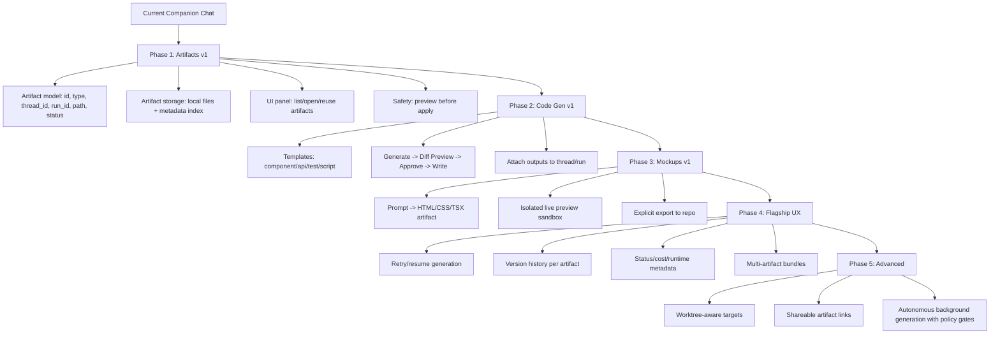
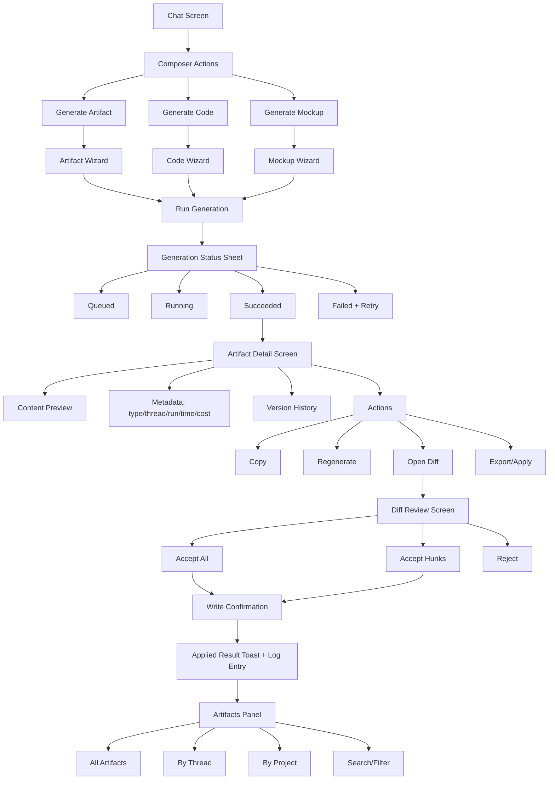

# Companion Flagship Surface: Artifacts + Code Gen + Mockups

**Date:** 2026-05-31  
**Author:** CDX (Codex)  
**Status:** Proposed implementation map for flagship all-in-one Companion experience

## Goal

Turn Companion into a flagship LLM app surface that removes manual copy/paste across multiple tools by providing:

- First-class artifacts
- Safe code generation and apply flow
- Mockup generation with preview/export
- Persistent history and recoverable runs

This should feel like one operating surface for ideation -> generation -> review -> apply.

## Product Direction

Companion should support this default workflow:

1. Prompt in chat
2. Generate one or more artifacts
3. Review output (preview + metadata + diff)
4. Approve and apply changes to workspace
5. Preserve version history and run traceability

The system must preserve safety:

- No silent writes to repo files
- All write paths go through explicit review/approval
- Every apply action is auditable

## Visual Roadmap



## Screen-by-Screen Flow



## Component Tree

```text
App
└─ ChatPage
   ├─ ChatThreadList
   ├─ ChatMessageList
   ├─ ChatComposer
   │  ├─ ActionMenu
   │  │  ├─ GenerateArtifactButton
   │  │  ├─ GenerateCodeButton
   │  │  └─ GenerateMockupButton
   │  └─ ModelSelector
   ├─ GenerationStatusSheet
   │  ├─ QueueState
   │  ├─ RunningState
   │  ├─ SuccessState
   │  └─ FailureState
   ├─ ArtifactsPanel
   │  ├─ ArtifactFilters (thread/project/type/status/search)
   │  ├─ ArtifactList
   │  │  └─ ArtifactListItem
   │  └─ ArtifactDetailDrawer
   │     ├─ PreviewTab
   │     ├─ DiffTab
   │     ├─ HistoryTab
   │     └─ MetadataTab
   ├─ DiffReviewModal
   │  ├─ FileDiffView
   │  ├─ HunkSelector
   │  └─ ApplyActions
   └─ ConfirmApplyModal
```

## Data Model

```json
{
	"artifact": {
		"id": "art_01...",
		"thread_id": "thr_01...",
		"run_id": "run_01...",
		"project": "LogueOS-Console",
		"type": "markdown|code|json|mockup|image",
		"title": "string",
		"status": "queued|running|succeeded|failed|applied|archived",
		"source_prompt": "string",
		"model": "string",
		"cost_usd": 0.0,
		"duration_ms": 0,
		"file_paths": ["/abs/path/..."],
		"preview_path": "/abs/path/preview.html",
		"diff_path": "/abs/path/diff.patch",
		"error": null,
		"version": 3,
		"created_at": "ISO8601",
		"updated_at": "ISO8601"
	}
}
```

## API Contract

### `POST /api/artifacts/generate`

Request:

```json
{
	"thread_id": "thr_01",
	"project": "LogueOS-Console",
	"mode": "artifact|code|mockup",
	"prompt": "Build a responsive settings panel",
	"template": "react_component",
	"target_paths": ["src/lib/components/SettingsPanel.svelte"],
	"options": {
		"model": "gemini-2.5-flash",
		"temperature": 0.2
	}
}
```

Response:

```json
{
	"artifact_id": "art_01",
	"run_id": "run_01",
	"status": "queued"
}
```

### Other routes

- `GET /api/artifacts/:id`
- `GET /api/artifacts?thread_id=&project=&type=&status=&q=`
- `POST /api/artifacts/:id/regenerate`
- `GET /api/artifacts/:id/diff`
- `POST /api/artifacts/:id/apply`
- `POST /api/artifacts/:id/archive`
- `GET /api/artifacts/:id/history`

Apply request example:

```json
{
	"approve": true,
	"strategy": "all|selected_hunks",
	"selected_hunks": ["hunk_1", "hunk_4"]
}
```

## Client State Shape

```text
artifactStore
- byId: Record<artifact_id, Artifact>
- list: artifact_id[]
- filters: {thread, project, type, status, q}
- activeArtifactId: string | null
- generationJobs: Record<run_id, {status, progress, error}>
- ui: {detailOpen, diffOpen, statusSheetOpen}
```

## Reliability + Safety Requirements

- Default write path is always: generate -> preview -> approve -> apply.
- Never auto-write repo files on generation success.
- Persist source hash pre/post apply for rollback visibility.
- Every apply action records actor, time, target files, selected hunks.
- Failed generations must support retry with preserved parameters.

## Why This Is Flagship

This reduces tool sprawl and manual transfer friction:

- Single chat-driven operating surface
- Structured outputs instead of ad-hoc copy/paste
- Safe write controls with diff review
- Durable artifacts and version history
- Clear operator confidence through metadata and auditability

## Recommended Build Order

1. Artifacts v1 storage + panel + detail view
2. Code-gen diff/apply flow
3. Mockup generation + isolated preview
4. Versioning + resume/retry + cost/runtime metadata
5. Advanced worktree-aware and bundle generation
